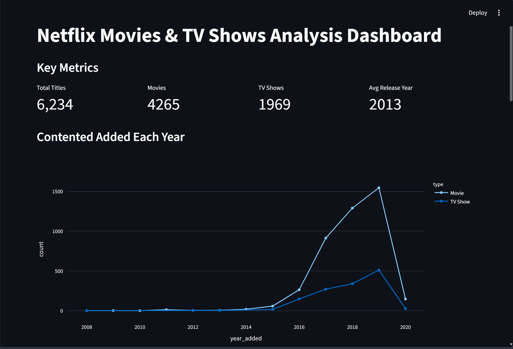
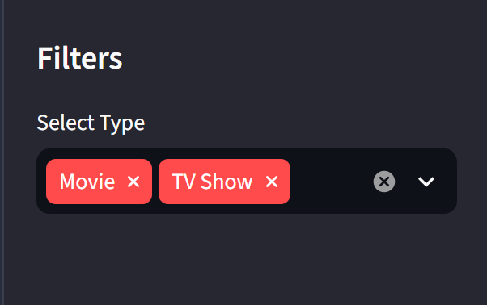
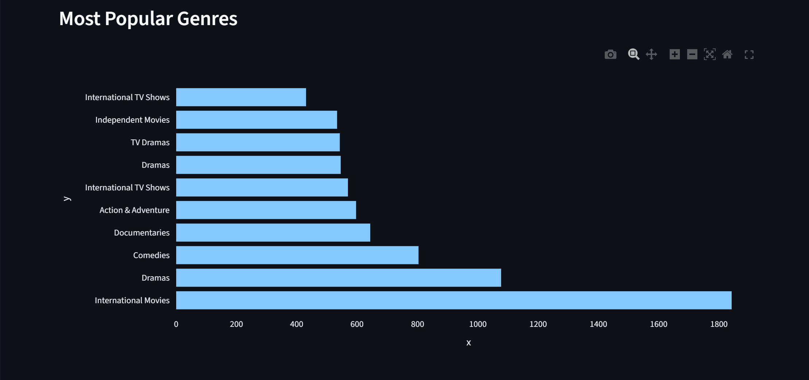
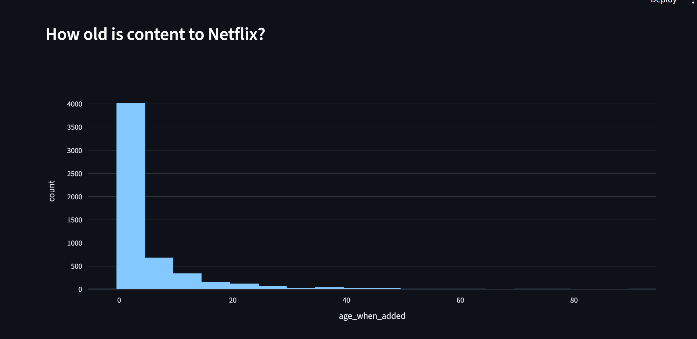
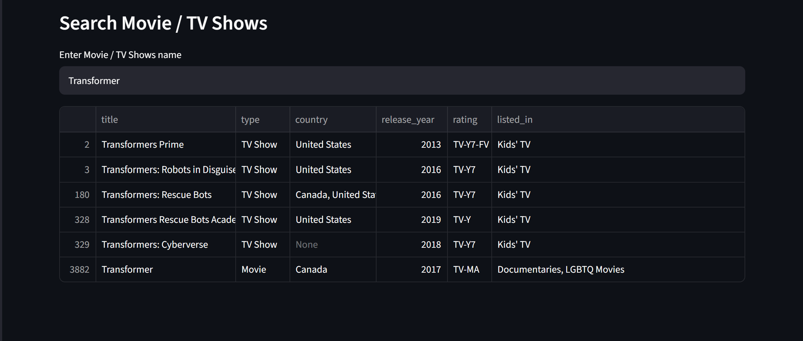

# 🎬 Netflix Movies & TV Shows Analysis Dashboard

An interactive Netflix Data Analysis Dashboard built using Python and Streamlit. This project provides insights into Netflix Movies and TV Shows through visualizations, filters, and search functionality.

---


## 🚀 Features

✅ Interactive Dashboard

✅ Key Metrics Overview

- Total Titles
- Total Movies
- Total TV Shows
- Average Release Year

✅ Filters

- Movie / TV Show Selection

✅ Visualizations

- Content Added Each Year
- Most Popular Genres
- Content Age Distribution

✅ Search Functionality

- Search Movies and TV Shows by Name

---

## 🛠️ Tech Stack

- Python
- Streamlit
- Pandas
- Matplotlib
- Plotly

---
## 📊 Dataset

Dataset: Netflix Movies and TV Shows Dataset

Contains:
- Title
- Type
- Release Year
- Country
- Rating
- Genre
- Date Added

## 📂 Project Structure

```text
Netflix_Analysis/
│
├── data_analysis/
├── netflix_analysis/
├── dataset/
│   └── netflix_titles.csv
├── screenshots/
├── manage.py
├── README.md
└── .gitignore
```

---

## ⚙️ Installation

### 1. Clone Repository

```bash
git clone https://github.com/shravani0540/Netflix-Analysis.git
```

### 2. Navigate to Project Folder

```bash
cd Netflix-Analysis
```

### 3. Install Dependencies

```bash
pip install -r requirements.txt
```

### 4. Run Application

```bash
streamlit run app.py
```

---

## 📸 Screenshots

### Dashboard Overview



### Filters



### Genre Analysis



## Content



### Search Feature




---

## 🎯 Purpose

This project was created to analyze Netflix content and gain insights into:

- Content Trends
- Genre Popularity
- Movies vs TV Shows Distribution
- Netflix Content Growth Over Time

---

## 🔮 Future Enhancements

- Country Analysis
- Rating Analysis
- Recommendation System
- Download Filtered Data
- Advanced Search Filters

---

## 👩‍💻 Author

**Shravani Dewade**

GitHub: https://github.com/shravani0540